# 写在前面

作为一个苦逼的码农，每天不是在写 bug 就是在写 bug 的路上，而一个好的代码检测工具则是我们的神兵利器。IDE 作为第一生产力对代码的检测的改进也一直没有停止步伐，并且允许集成各种代码检测插件。

比如笔者作为一个 Java 社畜，第一生产力理所当然的就是 `jetbranins` 家族的 `IntelliJ IDEA`，活跃的社区丰富的插件。而我们最常用的代码检测插件应该就是阿里出品的 `Alibaba Java Coding Guidelines`，跟大多数插件相同都是只能检测出简单的问题，而对深层次的漏洞则无法识别。

而 [SonarQube](https://www.sonarqube.org) 则可以说是这方面的专家，与其他的检测工具相比就跟 `Java` 中的 `==` 和 `equals`区别一样。话不多说，直接上图看下效果：

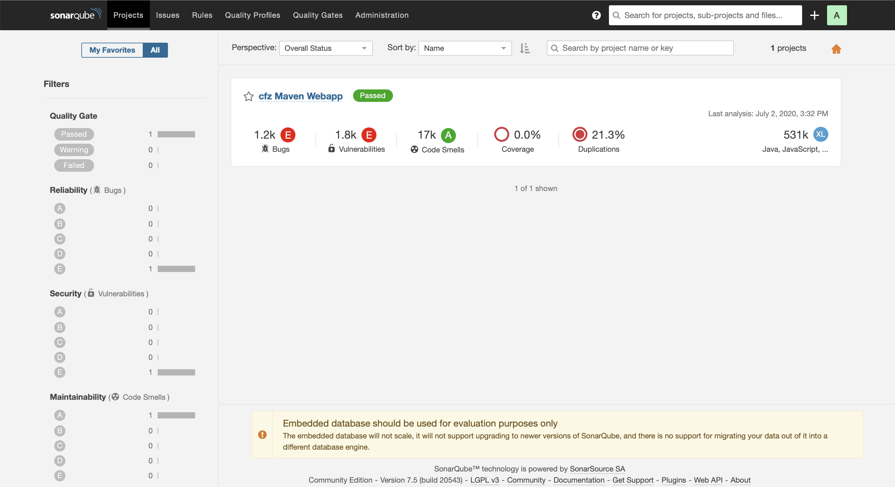

从该图中可以看到，[SonarQube](https://www.sonarqube.org) 检查出了 1.2k 个bug、1.8k 脆弱点以及可重构代码高达 21.3%（我还有什么可说的😷😷~）

点击查看 bugs 详情，就能看到更详细的 bug 描述信息：

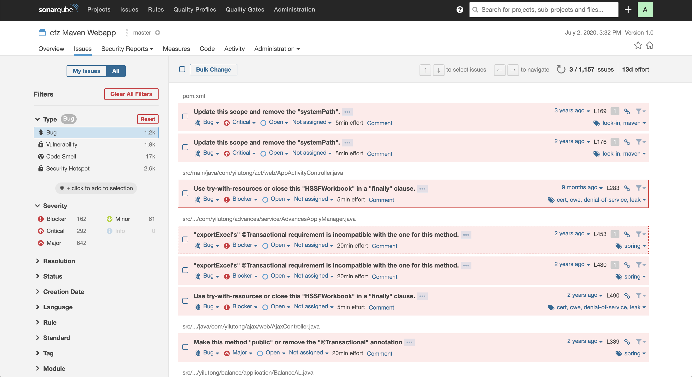

这么强大的神兵利器你还不心动？

现在就赶快来安装吧！

# 安装 SonarQube

本文基于`CentOS Linux release 7.8.2003 (Core)` 做说明，而 `SonarQube` 依赖 Java 环境，所以在安装之前需要保证当前系统已安装过 JVM，可以直接在控制台中输入 `java` 进行检查，建议 JDK 最低版本不低于 `JDK8`。

笔者当前还没有 Java 环境，所以直接使用 `yum` 安装 `open-jdk8`：

```bash
$ sudo yum install -y java-1.8.0-openjdk-devel

$ java -version
openjdk version "1.8.0_252"
OpenJDK Runtime Environment (build 1.8.0_252-b09)
OpenJDK 64-Bit Server VM (build 25.252-b09, mixed mode)
```

好了，基本的 java 环境已经准备好了，现在就来安装 [SonarQube](https://www.sonarqube.org)。

[SonarQube](https://www.sonarqube.org) 官网首页默认下载页面会自动下载最新版本，要求的 java 版本都很高（当前最新版本是 `8.3.1`，要求 JDK11）。所以我们通常都会到[二进制包下载列表页面](https://binaries.sonarsource.com/Distribution/sonarqube/)进行下载：


笔者下载的版本是：`sonarqube-7.5`，并保存到 `/opt/sonar/` 目录下，下载完成后进行解压：

```bash
$ sudo wget -O /opt/sonar/sonarqube-7.5.zip https://binaries.sonarsource.com/Distribution/sonarqube/sonarqube-7.5.zip
$ unzip sonarqube-7.5.zip
```

| Note                                                       |
| :--------------------------------------------------------- |
| 若想下载其他版本，直接选择该版本的 `.zip` 压缩包下载即可！ |

之后，就能得到解压后的文件：

```bash
$ ls /opt/sonar/
sonarqube-7.5  sonarqube-7.5.zip

$ ls /opt/sonar/sonarqube-7.5
COPYING  bin  conf  data  elasticsearch  extensions  lib  logs  temp  web
```

现在就来说下 `bin` 、`conf` 等文件夹的含义：

| 文件夹          | 描述                       |
| :-------------- | :------------------------- |
| `bin`           | 包含操作系统环境的运行脚本 |
| `conf`          | 配置文件夹                 |
| `data`          | 默认的数据存储目录         |
| `elasticsearch` | `elasticsearch` 依赖       |
| `extensions`    | 扩展包                     |
| `lib`           | 依赖包                     |
| `logs`          | 默认的日志输出目录         |
| `web`           | `web` 页面文件夹           |

而我们主要关心的是 `conf` 文件夹中的 `sonar.properties` 文件，该文件主要配置启动服务信息，如数据库信息、发布端口、日志存储目录等。

当前版本的数据库配置如下：

```properties
#--------------------------------------------------------------------------------------------------
# DATABASE
#
# IMPORTANT:
# - The embedded H2 database is used by default. It is recommended for tests but not for
#   production use. Supported databases are MySQL, Oracle, PostgreSQL and Microsoft SQLServer.
# - Changes to database connection URL (sonar.jdbc.url) can affect SonarSource licensed products.

# User credentials.
# Permissions to create tables, indices and triggers must be granted to JDBC user.
# The schema must be created first.
# sonar.jdbc.username=
# sonar.jdbc.password=

#----- Embedded Database (default)
# H2 embedded database server listening port, defaults to 9092
#sonar.embeddedDatabase.port=9092

#----- DEPRECATED
#----- MySQL >=5.6 && <8.0
# Support of MySQL is dropped in Data Center Editions and deprecated in all other editions
# Only InnoDB storage engine is supported (not myISAM).
# Only the bundled driver is supported. It can not be changed.
#sonar.jdbc.url=jdbc:mysql://localhost:3306/sonar?useUnicode=true&characterEncoding=utf8&rewriteBatchedStatements=true&useConfigs=maxPerformance&useSSL=false

#----- Oracle 11g/12c
# The Oracle JDBC driver must be copied into the directory extensions/jdbc-driver/oracle/.
# Only the thin client is supported, and only the versions 11.2.x or 12.2.x must be used. See
# https://jira.sonarsource.com/browse/SONAR-9758 for more details.
# If you need to set the schema, please refer to http://jira.sonarsource.com/browse/SONAR-5000
#sonar.jdbc.url=jdbc:oracle:thin:@localhost:1521/XE


#----- PostgreSQL 9.3 or greater
# By default the schema named "public" is used. It can be overridden with the parameter "currentSchema".
#sonar.jdbc.url=jdbc:postgresql://localhost/sonarqube?currentSchema=my_schema


#----- Microsoft SQLServer 2014/2016 and SQL Azure
# A database named sonar must exist and its collation must be case-sensitive (CS) and accent-sensitive (AS)
# Use the following connection string if you want to use integrated security with Microsoft Sql Server
# Do not set sonar.jdbc.username or sonar.jdbc.password property if you are using Integrated Security
# For Integrated Security to work, you have to download the Microsoft SQL JDBC driver package from
# https://www.microsoft.com/en-us/download/details.aspx?id=55539
# and copy sqljdbc_auth.dll to your path. You have to copy the 32 bit or 64 bit version of the dll
# depending upon the architecture of your server machine.
#sonar.jdbc.url=jdbc:sqlserver://localhost;databaseName=sonar;integratedSecurity=true

# Use the following connection string if you want to use SQL Auth while connecting to MS Sql Server.
# Set the sonar.jdbc.username and sonar.jdbc.password appropriately.
#sonar.jdbc.url=jdbc:sqlserver://localhost;databaseName=sonar
```

以上信息全部处于注释状态，原因是 `Sonar` 默认使用的 `H2`内嵌数据库，也是之后版本默认的数据库。除此之外，还支持 `MySQL`、`PostgreSQL` 等数据库。

而数据库的数据库密码统一使用如下配置：

```properties
# sonar.jdbc.username=
# sonar.jdbc.password=
```

如果想要使用本地的 MySQL 数据库，修改响应的配置即可，如：

```properties
sonar.jdbc.url=jdbc:mysql://172.16.6.209:3306/sonar?useUnicode=true&characterEncoding=utf8&rewriteBatchedStatements=true&useConfigs=maxPerformance&useSSL=false
```


<table>
	<thead>
		<tr>
			<td>Note</td>
		</tr>
	</thead>
	<tbody>
		<tr>
			<td>
				<code>SonarQube</code> 自 <code>7.9</code> 之后不再支持 <code>MySQL</code> 数据库，否则将会提示如下错误：<br/>
				<pre>jvm 1    | WrapperSimpleApp: Encountered an error running main: org.sonar.process.MessageException: Unsupported JDBC driver provider: mysql<br/>jvm 1    | org.sonar.process.MessageException: Unsupported JDBC driver provider: mysql</pre>
			</td>
		</tr>
	</tbody>
</table>

[SonarQube](https://www.sonarqube.org) 默认使用的端口号是 `9000`，可以通过如下配置进行修改：

```properties
sonar.web.port=9000
```

当前还有其他配置，如日志等。

在使用过程中想要修改配置的话直接在该配置文件中修改即可！

# 启动 SonarQube

[SonarQube](https://www.sonarqube.org) 解压即可使用，具体的脚本都在 `bin/` 目录下。该目录下包含多个平台的启动脚本：

```bash
$ ls bin/
jsw-license  linux-x86-32  linux-x86-64  macosx-universal-64  windows-x86-32  windows-x86-64
```

当前环境是 `Linux 64位`，所以我直接使用 `linux-x86-64` 目录下的脚本即可！

**注意：** [SonarQube](https://www.sonarqube.org) 不支持超级管理员（`sudo`）用户运行，所以我们应该单独创建一个用户，笔者就新创建一个 `sonar` 用户并加入到 `sonar` 组下：

```bash
$ sudo useradd sonar
$ sudo chown -R sonar.sonar /opt/sonar
```

之后就可以直接使用该应用运行了，命令如下：

```bash
# 启动, 另外有 console、start、status、stop
$ su sonar /opt/sonarsonarqube-7.5/bin/linux-x86-64/sonar.sh start
# 查看状态
$ su sonar /opt/sonar/sonarqube-7.5/bin/linux-x86-64/sonar.sh status
# 查看日志
$ tail -f /opt/sonar/sonarqube-7.5/logs/sonar.log
```

正常启动成功后就可以通过：`http://{ip}:9000` 访问了（默认的用户名密码都是 `admin`）：

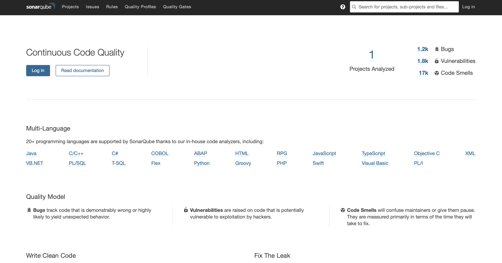


# 代码检测

登录成功后就能在首页看到 **Analyze New Project**：

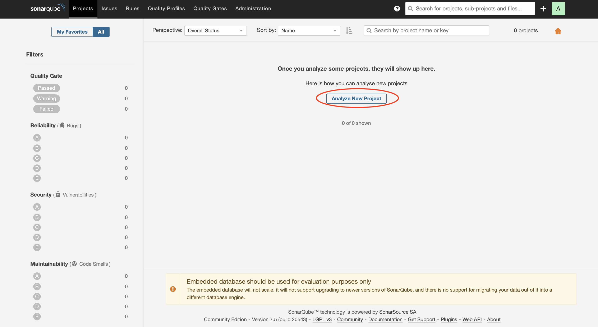

点击后，创建私有 Token。安装如下顺序：

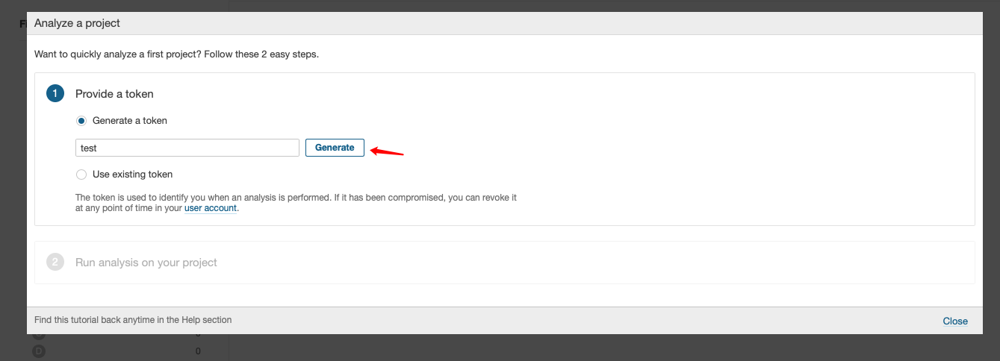

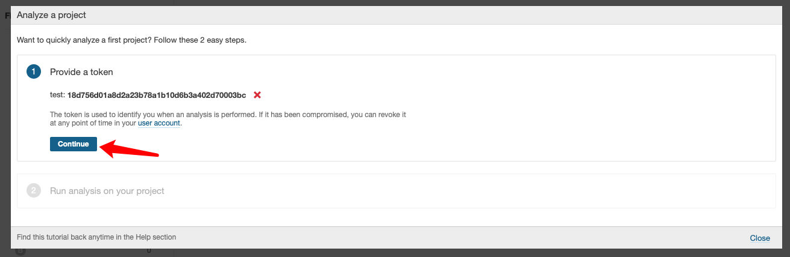

之后就可以选择你的项目语言了。比如笔者是 `Java - Maven` 项目，选择后就会在右侧生成执行指令：

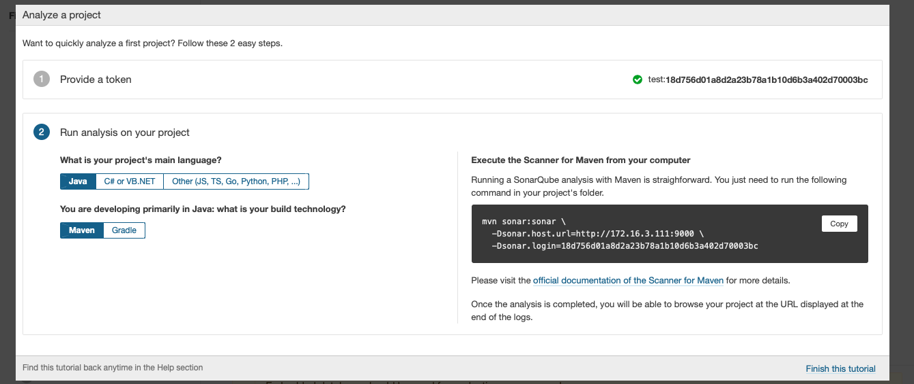

指令如下：

```bash
mvn sonar:sonar \
  -Dsonar.host.url=http://172.16.3.111:9000 \
  -Dsonar.login=18d756d01a8d2a23b78a1b10d6b3a402d70003bc
```

然后在你的项目根目录（与 `pom.xml`文件同级）执行该命令即可，示例：

```bash
$ cd $projectRoot

$ ls 
pom.xml ...

$ mvn sonar:sonar \
  -Dsonar.host.url=http://172.16.3.111:9000 \
  -Dsonar.login=18d756d01a8d2a23b78a1b10d6b3a402d70003bc
  
...
[INFO] ANALYSIS SUCCESSFUL, you can browse http://172.16.3.111:9000/dashboard?id=com.mingrn.spider%3Aadministrative-spider
[INFO] Note that you will be able to access the updated dashboard once the server has processed the submitted analysis report
[INFO] More about the report processing at http://172.16.3.111:9000/api/ce/task?id=AXMOyNPf5PQu6WTzo2MO
[INFO] Task total time: 8.775 s
[INFO] ------------------------------------------------------------------------
[INFO] BUILD SUCCESS
[INFO] ------------------------------------------------------------------------
[INFO] Total time:  10.567 s
[INFO] Finished at: 2020-07-02T17:08:29+08:00
[INFO] ------------------------------------------------------------------------
```

之后就能够在首页看到刚才分析的项目了：

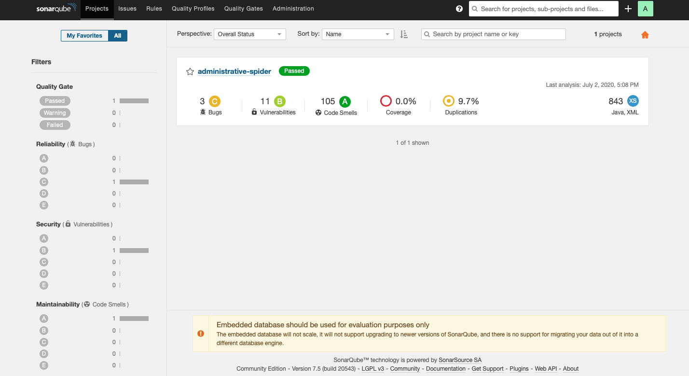


## 在 IntelliJ IDEA 中使用 SonarQube

除了在项目根目录执行指令，IDEA 插件库中也有 Sonar 插件，下载该插件后做做响应的配置即可单独分析项目或者分析指定的 Java 类。

在插件库中搜索：**SonarLint** 安装即可。

重启后就可以在设置中找到 SonarLint：

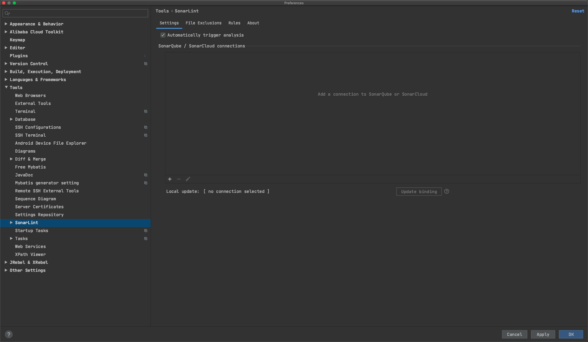

点击右侧将你之前搭建的 Sonar 加入即可：

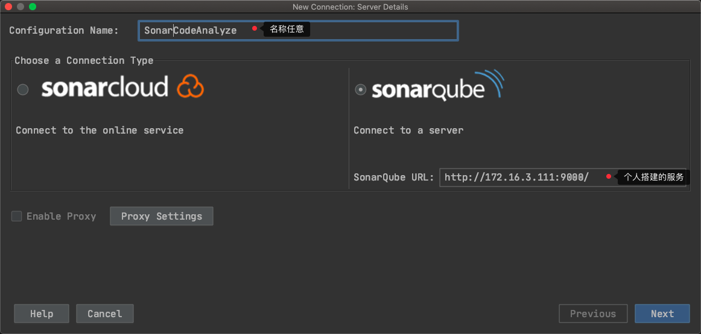

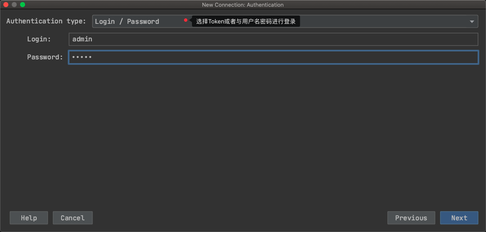

全部设置完成之后，在在项目目录或者某个 Java 类中右键就可以在菜单中找到 **Analyze With SonarLint** 了：

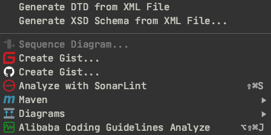


这样，Sonar 就大功告成了~

# 将 sonar 加入到系统服务

想一下，每次运行 sonar 都要输入如下命令是不是很累？

```bash
$ su sonar /opt/sonarsonarqube-7.5/bin/linux-x86-64/sonar.sh start
```

所以，我们可以考虑将 Sonar 加入到系统服务中！

新建一个 `sonar.service` 文件，内容如下：

```
[Unit]
Description=SonarQube Service
After=network.target

[Service]
Type=forking
User=sonar
Group=sonar

#---- 默认PID存储位置
# PIDFile=/opt/sonar/sonarqube-7.5/bin/linux-x86-64/SonarQube.pid

ExecStart=/opt/sonar/sonarqube-7.5/bin/linux-x86-64/sonar.sh start
ExecReload=/opt/sonar/sonarqube-7.5/bin/linux-x86-64/sonar.sh restart
ExecStop=/opt/sonar/sonarqube-7.5/bin/linux-x86-64/sonar.sh stop
PrivateTmp=true

[Install]
WantedBy=multi-user.target
```

| Note                                                        |
| :---------------------------------------------------------- |
| `ExecStart` 、`ExecReload` 等信息要根据个人安装目录进行修改 |

然后将该文件保存到 `/usr/lib/systemd/system` 目录下！

```bash
$ sudo mv sonar.service /usr/lib/systemd/system/
```

之后我们就可以任意使用 `systemctl` 命令了：

```bash
# 启动服务
systemctl start sonar

# 停止服务
systemctl stop sonar

# 查看状态
systemctl status sonar

# 设置开机自启
systemctl enable sonar
```

