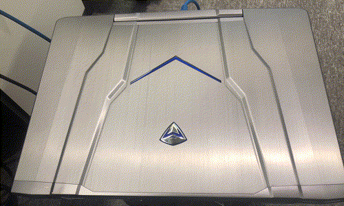

# 前言

作为开发人员通常因为各种原因会将个人电脑做成 `Linux` 服务器，大多数童鞋应该是抱着学习观摩的想法吧。

台式主机还好，不过如果是笔记本一类的便携设备的话我们通常会遇到一个问题：合上笔记本就直接进入入休眠模式无法继续对外提供服务了。

这种感jio超级蛋疼，为此呢我们就需要研究一下 `Linux` 的电源管理设置了🤐~

| Note                                                         |
| :----------------------------------------------------------- |
| 本文以 `CentOS7`  做说明：`CentOS Linux release 7.8.2003 (Core)`（`cat /etc/redhat-release`） |

# 电源管理

`Linux` 的电源管理通常是一个被称为 **登录管理器配置** 的文件，该文件在系统中的位置通常如下：

```bash
/etc/systemd/logind.conf
/etc/systemd/logind.conf.d/*.conf
/run/systemd/logind.conf.d/*.conf
/usr/lib/systemd/logind.conf.d/*.conf
```

默认的设置通常是在编译期间就确定了，默认的文件（初始配置文件）配置文件在 `/etc/systemd` 目录下。有一点需要说明，`/etc` 目录是超级管理员用户( `sudo` ) 才有的权限，所以如果是其他用户想要修改电源配置就需要将该文件拷贝到 `/usr/lib/systemd/*.conf.d/` 的目录下然后再做修改。`/etc` 作为主配置，优先级也是最低的，所以 `*.conf.d/` 目录中的配置会覆盖主配置。

同样的，如果管理员想要屏蔽 `/usr/lib/` 目录中的某个配置文件最佳的做法就是在 `/etc` 目录中创建一个指向 `/dev/null` 的同名符号链接即可彻底屏蔽 `/usr/lib/` 目录中的同名文件了~

| Note                                                         |
| :----------------------------------------------------------- |
| 所有的 `*.conf.d` 目录中的配置统一是按照字典的顺序进行加载。所以，如果多个文件存在相同的配置，文件越靠后级别越高。所以，为了便于排序，建议将 `*.conf.d/`目录中的配置文件都加上两位阿拉伯数字作为文件名前缀。 |

现在就来看下主配置文件 `/etc/systemd/logind.conf` 默认的登录管理器配置内容：

```bash
$ cat /etc/systemd/logind.conf

[Login]
#NAutoVTs=6
#ReserveVT=6
#KillUserProcesses=no
#KillOnlyUsers=
#KillExcludeUsers=root
#InhibitDelayMaxSec=5
#HandlePowerKey=poweroff
#HandleSuspendKey=suspend
#HandleHibernateKey=hibernate
#HandleLidSwitch=suspend
#HandleLidSwitchDocked=ignore
#PowerKeyIgnoreInhibited=no
#SuspendKeyIgnoreInhibited=no
#HibernateKeyIgnoreInhibited=no
#LidSwitchIgnoreInhibited=yes
#IdleAction=ignore
#IdleActionSec=30min
#RuntimeDirectorySize=10%
#RemoveIPC=no
#UserTasksMax=
```

在该文件中展示的配置都处于注释状态，也就是其默认值。这么多配置真正与电源有关的配置是如下几个：

```bash
#IdleActionSec=30min

#IdleAction=ignore
#HandlePowerKey=poweroff
#HandleSuspendKey=suspend
#HandleHibernateKey=hibernate
#HandleLidSwitch=suspend
#HandleLidSwitchDocked=ignore

#PowerKeyIgnoreInhibited=no
#SuspendKeyIgnoreInhibited=no
#HibernateKeyIgnoreInhibited=no
#LidSwitchIgnoreInhibited=yes
```

这些值得示意如下：

```
#IdleActionSec: 接受的是一个正整数, 表示 x 时间后执行 IdleAction 的操作. 时间后缀有: ms, s, min, h 和 d

下面六个配置可选值相同, 下面会做说明
#IdleAction:                IdleActionSec 时间后执行的行为
#HandlePowerKey:            按下电源键执行的行为
#HandleSuspendKey:          自动待机挂起后执行的行为
#HandleHibernateKey:        按下休眠键执行的行为
#HandleLidSwitch:           笔记本合盖后执行的行为
#HandleLidSwitchDocked:     笔记本合盖后外接显示器的行为

下面四个值分别对应上面的六个配置, 可选值是 no/yes. 表示是否忽略上面配置的行为
#PowerKeyIgnoreInhibited:      按下电源键是否需要忽略 HandlePowerKey 配置的行为
#SuspendKeyIgnoreInhibited:    自动那个待机挂起后是否需要忽略 HandleSuspendKey 配置的行为
#HibernateKeyIgnoreInhibited:  按下休眠键后是否需要忽略 HandleHibernateKey 配置的行为
#LidSwitchIgnoreInhibited:     合上笔记本后是否需要忽略 HandleLidSwitch/HandleLidSwitchDocked 配置的行为
```

<table>
    <tr>
        <td>下面是六个配置的可选值</td>
    </tr>
    <tr>
        <td>
            <table>
                <tr>
                    <td>可选值</td>
                    <td>说明</td>
                </tr>
                <tr>
                    <td><code>ignore</code></td>
                    <td>忽略, 啥也不干</td>
                </tr>
                <tr>
                    <td><code>poweroff</code></td>
                    <td>关机</td>
                </tr>
                <tr>
                    <td><code>reboot</code></td>
                    <td>关机重启</td>
                </tr>
                <tr>
                    <td><code>halt</code></td>
                    <td>挂起, 停止所有的 CPU 功能, 但是仍然保持通电</td>
                </tr>
                <tr>
                    <td><code>kexec</code></td>
                    <td>仅可以调用内核 "kexec" 函数</td>
                </tr>
                <tr>
                    <td><code>suspend</code></td>
                    <td>待机</td>
                </tr>
                <tr>
                    <td><code>hibernate</code></td>
                    <td>睡眠（内存数据会存入硬盘并关闭电源）</td>
                </tr>
                <tr>
                    <td><code>hybrid-sleep</code></td>
                    <td>混合睡眠 = 睡眠 + 休眠, 主要是为台式机设计的, 内存和CPU还是活的</td>
                </tr>
                <tr>
                    <td><code>suspend-then-hibernate</code></td>
                    <td>先进入待机（suspend）然后再进入睡眠（hibernate）</td>
                </tr>
                <tr>
                    <td>lock</td>
                    <td>锁屏, 机器继续跑（相当于 WIN + L）</td>
                </tr>
            </table>
        </td>
    </tr>
</table>

# 测试

现在笔者就用自己的笔记本进行测试，因为笔记本做的是 CentOS 服务器而不是桌面版所有不存在外接显示器，仅仅将 `HandleLidSwitch` 修改为 `lock`，即合盖后机器继续正常跑：

```bash
HandleLidSwitch=lock
```

修改完成后进行保存完后重启 `systemd-logind.service` 服务：

```bash
sudo systemctl restart systemd-logind.service
```

完后合上笔记本！

| 合盖仪式                                |
| --------------------------------------- |
|  |

然后继续使用客户端进行连接：

```bash
$ ssh pri.srv1
Last login: Wed Jul  1 16:27:24 2020 from 172.16.6.209
[itumate@localhost ~]$
```

Perfect！！！！

# 参考资料

- [Ubuntu Manpage: logind.conf, logind.conf.d - 登陆管理器配置文件 ](https://manpages.ubuntu.com/manpages/cosmic/zh_CN/man5/logind.conf.5.html)