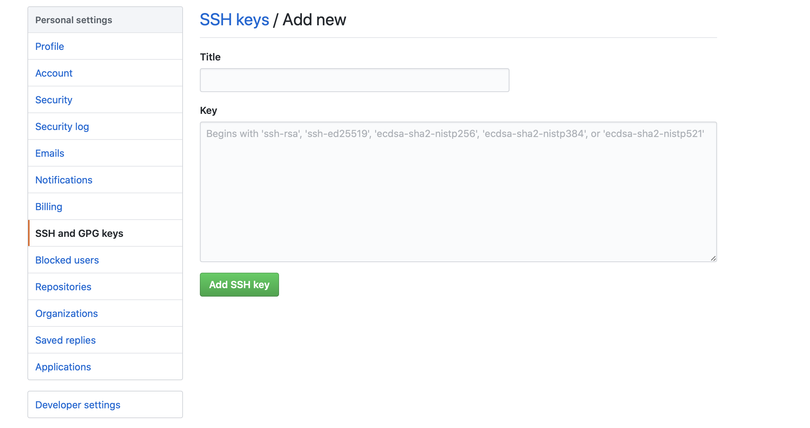

# SSK-Key/RSA 密匙生成以及口令登录

# 写在前面

简单的说， `SSH` 是一种网络协议，用于计算机之前的加密登录。

如果一个用户从本地计算机，使用 SSH 协议登录另一台计算机，我们就可以认为： **登录是安全的。** 即使被中途截获，密码也不会泄露。

最早的时候，互联网通信都是明文通信，一旦被截获，内容就暴露无疑。1995年，芬兰学者Tatu Ylonen设计了 `SSH` 协议。将登录信息全部加密，成为互联网安全的一个基本解决方案，迅速在全世界获得推广，目前已经成为 `Linux` 系统的标准配置。

需要指出的是， `SSH` 只是一种协议，存在多种实现，既有商业实现，也有开源实现。本文针对的实现是 `OpenSSH` ，它是自由软件，应用非常广泛。

SSH 协议主要使用的是非对称加密算法，生成一对密匙：公钥和私匙。下面就具体说下：

# SSH-Key 生成

SSH-Key 生成使用的命令是 `ssh-keygen` ，我们可以通过 `--help` 或 `man` 命令查看具体的使用帮助。

```bash
$ ssh-keygen --help
```

`ssh-keygen` 默认使用 `RSA` 加密算法，长度为 2048 位，生成一个私钥文件 `id_rsa` 和一个公钥文件 `id_rsa.pub` ，两个文件默认保存在用户的 `~/.ssh` 目录下。你可以在命令行交互过程指定密钥文件路径，也可以设置密钥口令，如果设置了密钥口令，在使用密钥进行登录时，需要输入口令。

以默认方式为例（一路回车。不需要任何操作）：

```bash
$ ssh-keygen
Generating public/private rsa key pair.
Enter file in which to save the key (/home/user/.ssh/id_rsa):
Enter passphrase (empty for no passphrase):
Enter same passphrase again:
Your identification has been saved in /home/user/.ssh/id_rsa.
Your public key has been saved in /home/user/.ssh/id_rsa.pub.
The key fingerprint is:
SHA256:MDZOlydppXHYkfQ5uBwx/OHDjilZs3iulLMSherwkKY user@localhost.localdomain
The key's randomart image is:
+---[RSA 2048]----+
|        .=Bo     |
|        .B+=..   |
|      *.B +++.   |
|     +.*.+oo=.   |
|   . ...S+o* .   |
|  = . . +.= .    |
| o =   .++       |
|E   o .. o.      |
|       .o.       |
+----[SHA256]-----+
```


最终，你会在 `~/.ssh` 目录下看到如下两个文件：

```bash
$ ls ~/.ssh/
id_rsa  id_rsa.pub
```


另外，生成密匙的通用格式如下：

```bash
$ ssh-keygen [-q] [-b bits] [-t dsa | ecdsa | ed25519 | rsa | rsa1] [-N new_passphrase] [-C comment] [-f output_keyfile]
```

下面对这些参数分别进行说明：

## 指定密匙长度

以 `RSA` 加密算法为例，默认情况下生成的密匙长度为 2048 位。也可以通过 `-b` 可选参数进行指定生成的密匙长度。

```bash
$ ssh-keygen [-b bits]
```

比如，指定生成的长度为 5000：

```bash
$ ssh-keygen -b 5000
```


## 指定加密算法

除此之外，也可以通过可选参数 `-t` 进行指定加密算法：

```bash
$ ssh-keygen [-t dsa | ecdsa | ed25519 | rsa | rsa1]
```

其中 `rsa` 是默认的加密算法，如需要使用 `dsa` 算法只需要轻松指定即可：

```bash
$ ssh-keygen -t dsa
```


## 指定生成密匙的口令

所谓的口令就是密码，这个口令有什么用呢？用 `github` 的例子来说：

我们通常会在 Github 配置页面配置 SSH，将公钥内容拷贝在 **Key** 所示的文本框中：



保存之后之后我们将本地代码提交 `Github` 时通常要求输入密码，这个密码就是这里所谓的口令。所以，如果指定了口令一定要牢记你的口令。

当然，如果忘了了你的口令你也可以使用如下命令进行修改口令：

```bash
$ ssh-keygen -p [-P old_passphrase] [-N new_passphrase] [-f keyfile]
```

现在，我们就来生成一个带有口令的 `RSA` 加密文件（其他选项使用默认即可，即一路回车）：

```bash
$ ssh-keygen -t rsa -N testpwd

Generating public/private rsa key pair.
Enter file in which to save the key (/home/user/.ssh/id_rsa):
Your identification has been saved in /home/user/.ssh/id_rsa.
Your public key has been saved in /home/user/.ssh/id_rsa.pub.
The key fingerprint is:
SHA256:zW05I+e5TBA4yVz0PVoWMDEXaGI1Qf1TUT59F5blaDA user@localhost.localdomain
The key's randomart image is:
+---[RSA 2048]----+
|         .ooE*+=B|
|       o +o.oOo*+|
|        *..o. BoB|
|         + o * o=|
|        S = O   .|
|           * +   |
|            +    |
|           o .   |
|            o    |
+----[SHA256]-----+
```

| Note                                                         |
| :----------------------------------------------------------- |
| 如果之前已经生成了 `rsa` 文件，通过该命令会生成一个新的 `rsa` 并直接替换已有的 `rsa` 文件，具体稍后会做说明。 |


如果你仔细比较本次生成的 `RSA` 与前面一次作比较，你会发现少了如下两个步骤：

```bash
Enter passphrase (empty for no passphrase):
Enter same passphrase again:
```

所以，现在你明白默认的步骤与该步骤的区别了吗？

在实际操作中，如果需要指定口令建议使用 `-N` 选项指定口令，而不是回车后在 `Enter passphrase` 中输入口令，原因是在 `Enter passphrase` 中输如的口令是隐式的，你无法看到具体的输入内容，仅仅靠记忆，即使输错了也不知道。

而且，还需要在 `Enter same passphrase again` 中再次输出口令以确定你没有输入错误。这样是不是比较麻烦？所以： 建议在生成带有口令密匙的 `rsa` 文件时建议指定 `-N` 用于铭文设置口令！

## 指定 SSH-Key 注释

指定加密文件注释使用的是 `-C` 参数，那这个有什么用呢？先别管有什么用，我们先随意生成一个再说：

```bash
$ ssh-keygen -t rsa -C "MyMail@mail.com"
```

生成完成之后，打开 `id_rsa.pub` 文件，看结尾处是不是有 `MyMail@mail.com` ？

所以，它的作用就是用于注释 `rsa` 文件。如果你有多个 `rsa`，你只需要打开 `rsa.pub` 文件看看注释即可知道该文件的用途，所以还是蛮有用的。

| Note                                                         |
| :----------------------------------------------------------- |
| 通常，在生成密匙的时候建议设置注释信息。因为很多网站和软件用这个注释作为密钥的名字，如 Github、Gitlab。另一方面对于多个 `rsa` 文件也可以有效的做区分。 |

## 指定生成 rsa 文件名称

如果你按照之前的步骤一步一步执行的，你在生成 rsa 文件时肯定有如下提示：

```
/home/user/.ssh/id_rsa already exists.
Overwrite (y/n)? y
```

这个提示是告诉你在 `~/.ssh` 目录下已经存在 `id_rsa` 文件了，是否进行覆盖？

诸君肯定都会有一个疑问：为什么每次生成的加密文件名称都一样的？怎么修改一个文件名称以便于生成多个加密文件！

好了，这回不用苦恼了，只需要使用 `-f` 指定要生成的 `rsa` 加密文件名称即可：

```bash
$ ssh-keygen -t rsa -C "MyNewRsa" -N "RsaPwd" -f ~/.ssh/mymail@mail.com
```

<table>
	<thead>
		<tr>
			<td>Note</td>
		</tr>
	</thead>
	<tbody>
		<tr>
			<td>
				<code>-f</code> 选项指定的是文件名称以及文件存储的位置，这里指定了存储的位置在 <code>~/.ssh/</code> 且文件名称是 <code>mymail@mail.com</code>。如果你不去指定路径会将文件生成在你执行命令的目录（即当前目录），这里需要注意！<br/>
				另外， <code>-f</code> 选项后面不能是字符串： <code>"~/.ssh/mymail@mail.com"</code> 。如果这么指定会报如下错误：<br />
				<pre>Saving key "~/.ssh/mymail@mail.com" failed: No such file or directory</pre> 
		</td>
	</tr>
	</tbody>
</table>

生成步骤如下：

```bash
Generating public/private rsa key pair.
Your identification has been saved in /home/user/.ssh/mymail@mail.com.
Your public key has been saved in /home/user/.ssh/mymail@mail.com.pub.
The key fingerprint is:
SHA256:K+PgzykFYdrqEA7/YnJtDEvpCK76W8L99IevX00maEA MyNewRsa
The key's randomart image is:
+---[RSA 2048]----+
|        E        |
|    o  .         |
|   + .  .        |
|o . o    . .     |
|oo o .  S o . o  |
|oo*.  .  o   =   |
|o*o*+.+ ..  . .  |
|o.B+** =. ..     |
|==o+.o* o=o      |
+----[SHA256]-----+
```

这时有趣的事情来了，在前面我们以默认的方式生成 `rsa` 时需要填写东西，当然我们是一路回车。这次居然不需要任何回车！

原因就是，之前默认的方式我们什么都没指定，所以在生成的时候回再次让你确定输入信息。这次直接显示的将所有要输入的选项都填写了，也就不需要再次确认了！

现在看下 `~/.ssh` 目录下生成的加密文件：

```bash
$ ls ~/.ssh/
id_rsa  id_rsa.pub  mymail@mail.com  mymail@mail.com.pub
```

到此，一个完整的 rsa 加密文件就生成完成了！下面就开始具体的应用了~

# SSH 口令登录

想一想在没有使用 `rsa` 非对称加密之前我们使用 `ssh` 登录远程主机如何实现？是不是如下方式：

```bash
ssh username@remoteHost:port
```

以主机 `172.16.3.208` 为例：

```bash
ssh username@172.16.3.208
```

接着我们需要输入 `172.16.3.208` 对应用户 `username` 的密码：

```bash
username@172.16.3.208's password:
```

如果密码输入错误后我们需要重新输入：

```bash
Permission denied, please try again.
```

现在，我们生成了 rsa 非对称加密文件之后，我们只需要将我们生成的公钥发送到远程主机，第一次需要输入登录密码，之后就不再需要输入任何密码了。将公钥发送到目标服务器使用的是 `ssh-copy-id` 命令。


## `ssh-copy-id` 将 RSA 公钥拷贝至目标服务器

`ssh-copy-id` 命令通用格式如下：

```bash
$ ssh-copy-id [-h|-?|-f|-n] [-i [identity_file]] [-p port] [[-o <ssh -o options>] ...] [user@]hostname
```

- `-i` 指定 `rsa` 公钥文件
- `-p` 登录目标服务器指定端口，默认是 22

现在就将公钥发送至 `172.16.3.208`  

```bash
$ ssh-copy-id -i ~/.ssh/id_rsa.pub <username>@172.16.3.208

/usr/bin/ssh-copy-id: INFO: Source of key(s) to be installed: "/home/user/.ssh/id_rsa.pub"
/usr/bin/ssh-copy-id: INFO: attempting to log in with the new key(s), to filter out any that are already installed
/usr/bin/ssh-copy-id: INFO: 1 key(s) remain to be installed -- if you are prompted now it is to install the new keys
<username>@172.16.3.208's password:
```

**注意：** `<username>` 是你要登录远程主机 `172.16.3.208` 的用户，该用户必须是远程主机已经存在的用户。回车后会提示我们输入远程主机用户 `<username>` 对应的密码，输入成功后输出如下信息：

```bash
Number of key(s) added: 1

Now try logging into the machine, with:   "ssh '<username>@172.16.3.208'"
and check to make sure that only the key(s) you wanted were added.
```

这段信息告诉我们，之后直接使用 `ssh '<username>@172.16.3.208'` 登录即可。来测试一下：

```bash
$ ssh '<username>@172.16.3.208'
Last login: Tue Feb 25 21:04:25 2020 from 172.16.3.18
```

<table>
	<thead>
		<tr>
			<td>Note</td>
		</tr>
	</thead>
	<tbody>
		<tr>
			<td>
				如果需要将 <code>rsa</code> 公钥发送远程主机，建议生成的 <code>rsa</code> 不要设置口令。如果设置口令，之后远程主机时虽然不需要远程主机的用户密码，但是要求你输入 <code>rsa</code> 口令，如下：<br />
				<pre>Enter passphrase for key '/home/user/.ssh/id_rsa':</pre><br />
				当然这个问题有解决方案见 <a href="#使用 ssh-add 解决私钥密码登录问题">使用 ssh-add 解决私钥密码登录问题</a>
			</td>
		</tr>
	</tbody>
</table>

想一下，尽管这种方式简便了许多，但是要求你记住远程 ip。虽然我们能够写脚本，但是依然不太方便。下面就来看另外一种更简单的方式！

## 使用 ssh_config

我们已经将 rsa 公钥发送到远程主机了！现在，我们在 `~/.ssh` 目录下新建一个文件 `config` ，如果已经有了就不需要创建了！

```bash
$ touch ~/.ssh/config
```

然后，在 `config` 文件中输入如下内容：

```bash
Host pri
     Port 22
     User <username>
     HostName 172.16.3.208
     IdentityFile ~/.ssh/id_rsa
     PreferredAuthentications publickey
```

- `pri` 是你为远程主机 `172.16.3.208` 设置的别名
- `Port` 是你要登录远程主机的端口号，默认就为 22
- `User` 是你要登录远程主机的用户，比如 `root` 
- `HostName` 是你的远程主机 IP
- `IdentityFile` 是你的 `rsa` 私钥文件
- `PreferredAuthentications` 指定你登录远程主机认证方法，我们使用的是公钥，指定为 `publickey` ，当然也可以使用密码

保存后，我们仅仅需要使用 `ssh pri` 即可完成登录！如何你在执行命令是出现如下错误说明文件权限问题：

```bash
Bad owner or permissions on ~/.ssh/config
```

只需要修改一个 `config` 文件权限即可：

```bash
$ chmod 600 ~/.ssh/config
```

现在，再说之前的那个问题：在创建 `rsa` 文件时设置了口令，在使用 `ssh` 登录时要求输入口令密码如何解决？

就是说，将公钥发送到远程主机了。虽然下次登录远程主机不需要输入远程主机用户的密码了，但是要求你输入生成 `rsa` 文件时设置的口令！如果你没设置口令，恭喜你，你没有该问题 :)

解决该问题我们又要需要使用另外一个命令： `ssh-add` 

## 使用 ssh-add 解决私钥密码登录问题

这里不会对 `ssh-add` 进行过多说明，直接说怎么使用 `ssh-add` 解决该问题！

想一下，我们已经使用 `rsa` 文件了。那是否能够将 rsa 私钥密码设置到代理中呢？ `ssh-add` 就能完成该事情！命令如下：

```bash
$ ssh-add ~/.ssh/id_rsa
```

其中， `id_rsa` 就是你要指定的私钥文件。如果回车后出现如下问题，原因是 `ssh-add` 与 `ssh` 需要一个环境变量来完成如何与 `ssh` 代理通信。

```bash
Could not open a connection to your authentication agent.
```

只需要执行如下命令即可：

```bash
$ eval "$(ssh-agent)"
```

不过，该命令无法持久，退出登录后下载再次登陆执行 `ssh-add` 命令依然会提示该问题。如果想要一劳永逸，在你的用户目录下配置文件 `~/.bash_profile` 或 `~/.bashrc` 文件中添加如下配置，当然也可以直接在系统配置 `/etc/profile` 中增加如下配置：

```bash
# Add ssh-add to your Bash config file
SSHAGENT=/usr/bin/ssh-agent
SSHAGENTARGS="-s"
if [ -z "$SSH_AUTH_SOCK" -a -x "$SSHAGENT" ]; then
    eval `$SSHAGENT $SSHAGENTARGS`
    trap "kill $SSH_AGENT_PID" 0
fi
```

接着重试一下上面 `ssh-add ~/.ssh/id_rsa` 命令，会要求你输入 `rsa` 私钥密码：

```bash
Enter passphrase for /home/user/.ssh/id_rsa:
```

输入完成后输出如下信息即表示完成了：

```bash
Identity added: /home/user/.ssh/id_rsa (/home/user/.ssh/id_rsa)
```

之后，直接使用 `ssh pri` 即可完成登录！

## 解决 ssh 登录活性问题

在日常使用中，使用 ssh 登录远程主机后你是否遇到过长时间不做操作掉线问题？原因是连接超时了，下次操作又需要重新登录，特烦！

解决起来也很简单，有两种方法：

- **在服务端：**  

前提是你要有修改 server 配置权限的情况下，修改 server 端的 `/etc/ssh/sshd_config` ，在文件中输入如下配置：

```bash
ClientAliveInterval 60 #server每隔60秒发送一次请求给client,然后client响应,从而保持连接
ClientAliveCountMax 3  #server发出请求后,客户端没有响应得次数达到3,就自动断开连接.正常情况下, client不会不响应
```

- **在客户端：**

如果没有修改服务端配置权限的的话，可以直接修改本地客户端配置。修改`/etc/ssh/ssh_config` 文件，在文件中输入如下配置：

```bash
ServerAliveInterval 60  #client每隔60秒发送一次请求给server, 然后server响应, 从而保持连接
ServerAliveCountMax 3   #client发出请求后, 服务器端没有响应得次数达到3, 就自动断开连接. 正常情况下, server不会不响应
```

| Note                                                         |
| :----------------------------------------------------------- |
| 上面配置的数值时任意的。另外，还有其他可选配置信息。具体可以通过 `man sshd_config` 命令查看其他的配置命令 |


如果是想要配置在 `~/.ssh/config` 文件中的话可以使用如下方式：

```bash
Host *
     ServerAliveInterval 60
     ServerAliveCountMax 3
```

`Host *` 表示匹配所有主机，如果在 `config` 文件中还有其他主机，如：

```bash
Host pri
     Port 22
     User <username>
     HostName 172.16.3.208
     IdentityFile ~/.ssh/id_rsa
     PreferredAuthentications publickey
```

上面的配置同样对该主机生效！

# 常见问题
有时候，我们使用 `ssh-copy-id` 命令将 `rsa` 公钥已经发送到了远程服务器，但是依然遇到无法直接 `ssh username@remoteHost` 登录问题，这个根本原因可能是服务器配置的问题。你需要登录到目标服务器，使用超级管理员权限及 `root` 查看 `/etc/ssh/sshd_config` 文件的配置了，主要是如下两个：

```bash
PubkeyAuthentication yes
AuthorizedKeysFile .ssh/authorized_keys
```

另外，还有一点。当我们使用 `ssh pri` 登录远程主机时要保证已经使用 `ssh username@ip` 进行成功登陆过，因为在成功登录之后会在 `config` 同级目录下会生成一个名为 `known_hosts` 的文件。该文件中记录了登录的 IP 信息，如果第一次因为口令原因登录失败建议先删除该文件中保存的 IP 信息，然后再次登录。